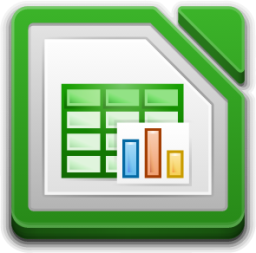

<!-- IMAGEM HEADER -->

<!-- TÍTULO PRINCIPAL -->
# Rafael Santana

<!-- TEXTO DINÂMICO -->

  

    
  

<!-- SOBRE MIM -->
## Sobre Mim
-  Desenvolvedor em formação, com sede de aprender e evoluir sempre.
-  Meu objetivo é construir uma base sólida tanto em linguagens de front-end quanto em back-end.
-  Estou estudando JavaScript e praticando HTML e CSS diariamente – e estou adorando o processo!
-  Tenho interesse em explorar, no futuro, áreas como desenvolvimento de games e bancos de dados.
-  Além da tecnologia, sou apaixonado por cinema, literatura e bicicletas.
-  Adoro simplificar processos e desenvolver soluções criativas.
-  Fique à vontade para explorar meus repositórios e acompanhar meu progresso!

<!-- TECNOLOGIAS -->
## Tecnologias

<!-- LINGUAGENS E FRAMEWORKS QUE ESTOU ESTUDANDO -->
### Linguagens

  
  
  

<!-- FERRAMENTAS DO DIA A DIA -->
### Ferramentas do dia a dia

  
  
  
  
  
  

<!-- PLATAFORMAS DE ESTUDO -->
### Plataformas de Estudo Favoritas

  
  
  
  
  

<!-- 
GITHUB STATS 

  <a href="https://github.com/rafa-san">
  
  

-->

<!-- CONTATO -->
## Contato

  
  

<!-- FRASE/TRECHO/POEMA -->
## Para Inspirar e Refletir

<!-- IMAGEM FOOTER -->
